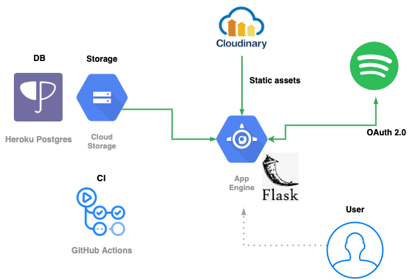

# Spotify WordCloud

[](https://app.codacy.com/gh/HelloRusk/spotify-wordcloud?utm_source=github.com&utm_medium=referral&utm_content=HelloRusk/spotify-wordcloud&utm_campaign=Badge_Grade) [](https://github.com/HelloRusk/spotify-wordcloud/actions) [](https://github.com/ambv/black) 

English · [日本語](./docs/README_ja.md)

---

<br>
<div align="center">
  
</div>
<br>

Spotify WordCloud is an app that lets you create a word cloud from the names of your favorite artists.  
You can tweet the word cloud on the spot. You can also save the word cloud and look back at it later.

👉 **[spotify-word.cloud](https://spotify-word.cloud)**  
(currently only available in Japanese)

<br>
<div align="center">
  
</div>
<br>

## Local development

### Requirements

- Docker
- Python 3.8
- Spotify Account
- GCP Account (to save images in Google Cloud Storage)

### Installation

```
$ git clone https://github.com/HelloRusk/spotify-wordcloud
$ cd spotify-wordcloud
$ poetry install
$ poetry shell
```

### Configuration

Set local environment variables in `.env`.  
You can refer to `.env.example`.

### Initialize DB

```
$ docker-compose up -d
$ FLASK_DEBUG=True FLASK_APP=run.py flask shell
>>> from spotify_wordcloud.app import db
>>> db.create_all()
```

### Run server

```
$ FLASK_DEBUG=True OAUTHLIB_INSECURE_TRANSPORT=1 python run.py
```

and open `http://localhost:5000/`.

## Test

```
$ TESTING=True python -m pytest
```

## URL

| Path                      | Method | Description                                                                                                                   |
| :------------------------ | :----- | :---------------------------------------------------------------------------------------------------------------------------- |
| /                         | GET    | Display the top screen                                                                                                        |
| /login                    | GET    | Log in to Spotify                                                                                                             |
| /login/spotify/authorized | GET    | Callback for Spotify OAuth authentication                                                                                     |
| /logout                   | GET    | Log out                                                                                                 |
| /generate                 | GET    | Create a word cloud image and return its binary                                                                               |
| /regenerate               | GET    | Create a word cloud image and return its binary <br>(Unlike /generate method, it forces re-creation even if there is a cache) |
| /save                     | POST   | Create a word cloud image, upload the image to GCS, and save it in the DB with user ID and creation date                       |
| /shareLink                | GET   | Create a word cloud image and obatin the link |
| /shareTwitter             | POST   | Create a word cloud image and open the tweet screen                                                                                        |
| /share/:file_hash         | GET    | Entry for Open Graph Protocol |
| /history                  | GET    | Display the list of images created in the past                                                                                |
| /history/:file_hash       | DELETE | Delete the specified image                                                                                                    |

#### Learn more about creating word cloud images

This app retrieves the list of top artists from Spotify's "Get a User's Top Artists" API, combines them into a single string, and creates a word cloud based on it.  
The combined string is kept in the session. The image is placed in the `/tmp` folder with the hash of the string as the file name.  
URLs related to image creation will always try to refer to these cached information first. However, /regenerate does not refer to the `/tmp` folder, and creates the image again.
