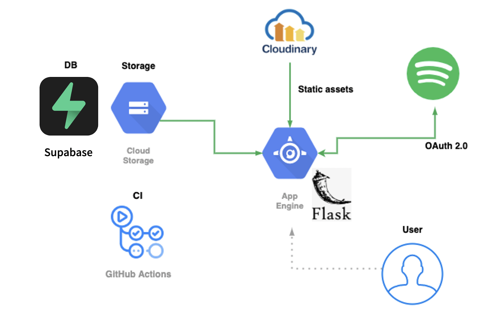

# Spotify WordCloud

[](https://app.codacy.com/gh/HelloRusk/spotify-wordcloud?utm_source=github.com&utm_medium=referral&utm_content=HelloRusk/spotify-wordcloud&utm_campaign=Badge_Grade) [](https://github.com/HelloRusk/spotify-wordcloud/actions) [](https://github.com/ambv/black) 

[English](../README.md) · 日本語

---

<br>
<div align="center">
  
</div>
<br>

Spotify WordCloud はあなたのお気に入りのアーティストの名前からワードクラウドを作るアプリです.  
ワードクラウドをその場でツイートすることができます. また, ワードクラウドを保存して, あとから見返すこともできます.

👉 **[spotify-word.cloud](https://spotify-word.cloud)**  

<br>
<div align="center">
  
</div>
<br>

## Local development

### Requirements

- Docker
- Python 3.8
- Spotify Account
- GCP Account (to save images in Google Cloud Storage)

### Installation

```
$ git clone https://github.com/HelloRusk/spotify-wordcloud
$ cd spotify-wordcloud
$ poetry install
$ poetry shell
```

### Configuration

Set local environment variables in `.env`.  
You can refer to `.env.example`.

### Initialize DB

```
$ docker-compose up -d
$ FLASK_APP=run.py flask shell
>>> from spotify_wordcloud.app import db
>>> db.create_all()
```

### Run server

```
$ FLASK_DEBUG=True OAUTHLIB_INSECURE_TRANSPORT=1 python run.py
```

and open `http://localhost:5000/`.

## Test

```
$ TESTING=True python -m pytest
```

## URL

| パス                      | メソッド | 内容                                                                                                              |
| :------------------------ | :------- | :---------------------------------------------------------------------------------------------------------------- |
| /                         | GET      | トップ画面の表示                                                                                                  |
| /login                    | GET      | Spotify へのログイン                                                                                              |
| /login/spotify/authorized | GET      | Spotify OAuth 認証のコールバック                                                                                  |
| /logout                   | GET    | ログアウト                                                                                                 |
| /generate                 | GET      | ワードクラウド画像を作成し, そのバイナリを返す API                                                                |
| /regenerate               | GET      | ワードクラウド画像を作成し, そのバイナリを返す API （ generate と異なり, キャッシュがあっても強制的に再作成する） |
| /save                     | POST     | ワードクラウド画像を作成し, 画像を GCS にアップロードした上で, ユーザー ID, 作成日時とともに DB に保存する         |
| /shareLink                | GET     | ワードクラウド画像を作成し, 画像付きリンクを取得する |
| /shareTwitter             | POST     | ワードクラウド画像を作成し, ツイート画面を開く                                                                          |
| /share/:file_hash         | GET    | OGP画像用のエントリ |
| /history                  | GET      | 過去に作成した画像一覧の表示                                                                                      |
| /history/:file_hash       | DELETE   | 指定された画像の削除                                                                                              |

#### ワードクラウド画像の作成について

Spotify の "Get a User's Top Artists" API からトップアーティスト一覧を取得し, 1 つの文字列として組み合わせてから, それをもとにワードクラウドを作成する.  
組み合わされた文字列はセッションに保持する. また, 文字列をハッシュ化したものをファイル名として, 作成した画像を `/tmp` フォルダ以下に置く.  
画像作成に関連する URL は常に, まずこれらのキャッシュ情報を最初に参照するように試みる. ただし, /regenerate では `/tmp` フォルダ以下を参照せず, 再び画像を作成する.

## Special Thanks!

[Spotify WordCloud を使ってくれた人まとめ](https://www.notion.so/Spotify-WordCloud-731b47bc655341fda54addf855ab4133)